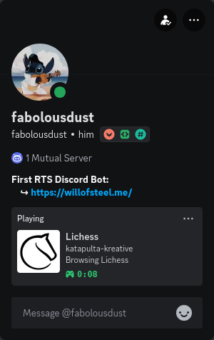

# Lichess RPC by fabolousdust

This is quite new as a project and I intend to make it better and with more functions in the future. Also I hope to make it an extension as well so you don't have to run it client-side everytime you open lichess. Code is open-source all, so feel free to open any issue or suggestion, I will try to read them when I can. So this is how it looks like:

---

 
 

---

# BIG TITLE HERE

- List here  
- Of stuff  
- Over here  
